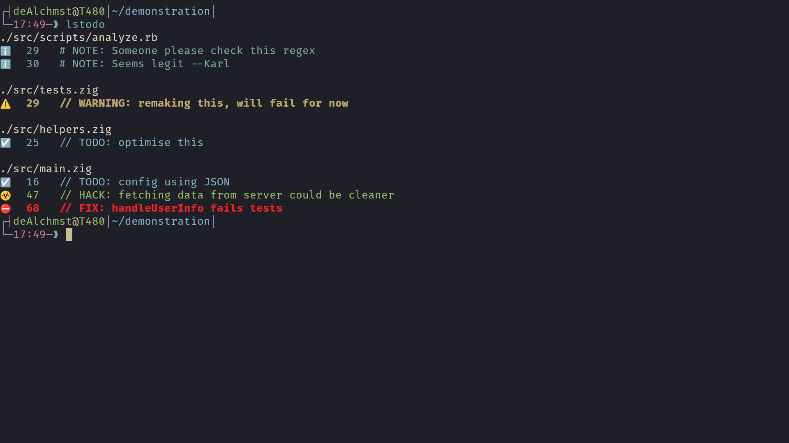

# lstodo

Lstodo is simple command line application to list user defined `TODO:`-like labels in your text files.



## installation
To install locally, run the following:
```bash
git clone https://github.com/De-Alchmst/lstodo.git
cd lstodo
ruby install.rb
```
Or run the following, to install globally:
```bash
git clone https://github.com/De-Alchmst/lstodo.git
cd lstodo
ruby install.rb --global-install
```

## configuration
Upon usage, lstodo generates `lstodo.json` in `XDG-CONFIG-HOME` or `$HOME/.config` on unix-like platforms or `%LocalAppData%\lstodo` on windows. Config can be regenerated with `lstodo -r`.  Following stuff can be configured:
+ labels
	* list: [name, icon, formatting via escape sequences]
+ ignored file names defined by shell names
+ ignored file names defined by regex

Default labels
+ TODO:
+ NOTE:
+ WARNING:
+ FIX:
+ FIXME:
+ HACK:

Default ignored file names
+ `lstodo.rb`
+ `lstodo.json`
+ `node_modules`
+ `bin`
+ `lib`
+ everything starting with `.`
